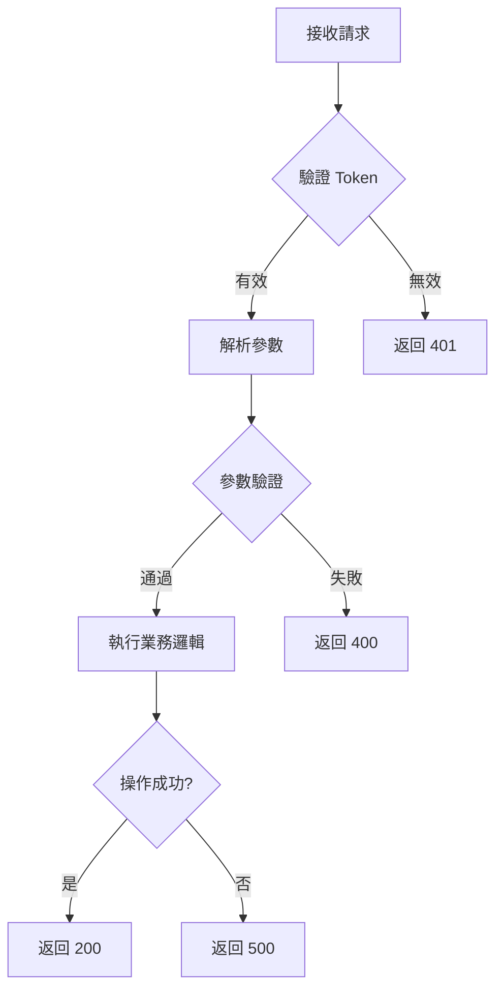
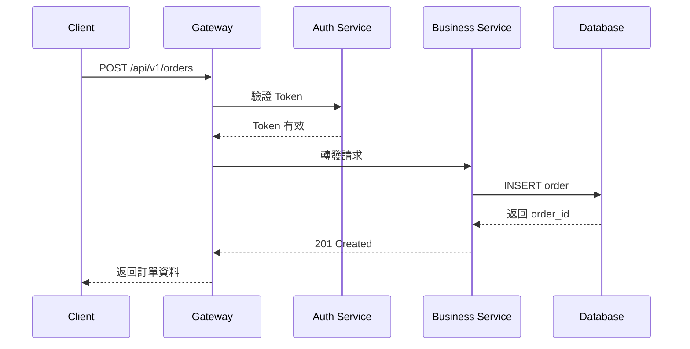
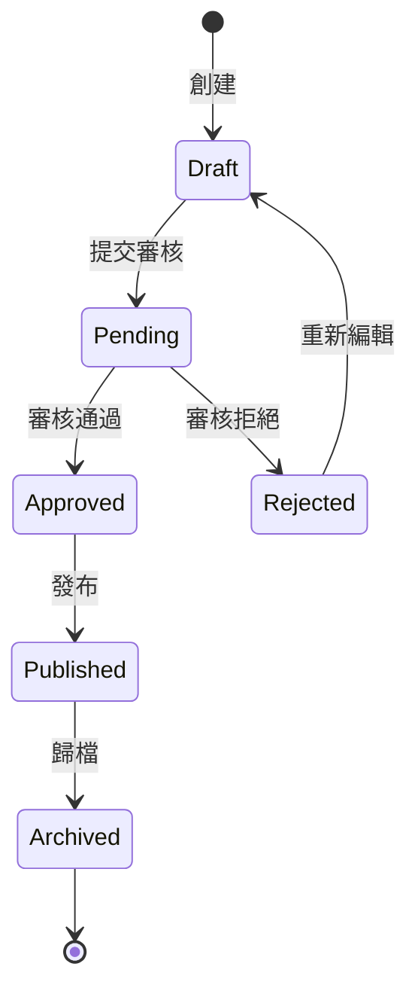
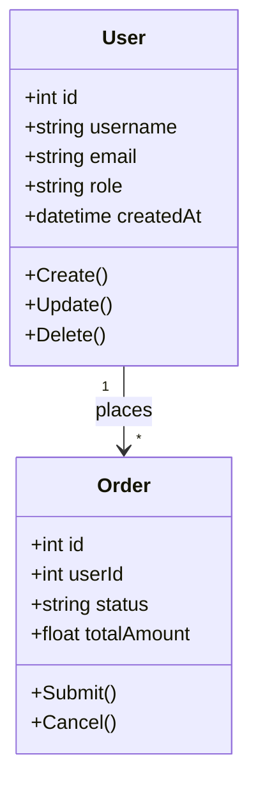
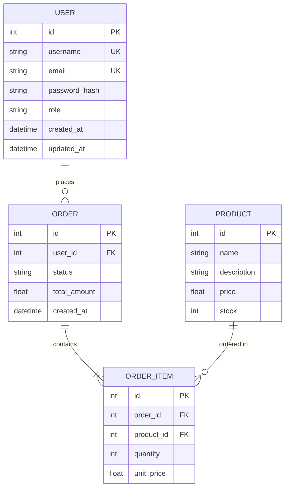

# 圖表撰寫指南

## 目錄
1. [Mermaid 圖表類型](#mermaid)
2. [SVG 動態流程圖](#svg-flow)
3. [數據庫 ER 圖](#er-diagram)
4. [使用場景對照](#usage)

---

## 1. Mermaid 圖表類型 {#mermaid}

### 流程圖 (Flowchart) - 業務邏輯流程



### 時序圖 (Sequence) - API 調用流程



### 狀態圖 (State) - 資源狀態流轉



### 類圖 (Class) - 數據模型



---

## 2. SVG 動態流程圖 {#svg-flow}

僅限 HTML 格式文檔使用。用於展示數據流動、請求路徑等。

### 基本動態箭頭模板

```html
<svg width="600" height="200" viewBox="0 0 600 200">
  <defs>
    <marker id="arrowhead" markerWidth="10" markerHeight="7"
            refX="10" refY="3.5" orient="auto">
      <polygon points="0 0, 10 3.5, 0 7" fill="#2563eb"/>
    </marker>
  </defs>

  <!-- 節點 -->
  <rect x="20" y="70" width="120" height="60" rx="10"
        fill="#dbeafe" stroke="#2563eb" stroke-width="2"/>
  <text x="80" y="105" text-anchor="middle"
        font-family="sans-serif" font-size="14" fill="#1e293b">Client</text>

  <rect x="240" y="70" width="120" height="60" rx="10"
        fill="#dbeafe" stroke="#2563eb" stroke-width="2"/>
  <text x="300" y="105" text-anchor="middle"
        font-family="sans-serif" font-size="14" fill="#1e293b">Server</text>

  <rect x="460" y="70" width="120" height="60" rx="10"
        fill="#dbeafe" stroke="#2563eb" stroke-width="2"/>
  <text x="520" y="105" text-anchor="middle"
        font-family="sans-serif" font-size="14" fill="#1e293b">Database</text>

  <!-- 動態箭頭 -->
  <line x1="140" y1="100" x2="240" y2="100"
        stroke="#2563eb" stroke-width="2" marker-end="url(#arrowhead)"
        stroke-dasharray="10 5">
    <animate attributeName="stroke-dashoffset"
             from="0" to="-20" dur="1s" repeatCount="indefinite"/>
  </line>

  <line x1="360" y1="100" x2="460" y2="100"
        stroke="#2563eb" stroke-width="2" marker-end="url(#arrowhead)"
        stroke-dasharray="10 5">
    <animate attributeName="stroke-dashoffset"
             from="0" to="-20" dur="1s" repeatCount="indefinite"/>
  </line>

  <!-- 標籤 -->
  <text x="190" y="90" text-anchor="middle"
        font-family="sans-serif" font-size="11" fill="#64748b">HTTP Request</text>
  <text x="410" y="90" text-anchor="middle"
        font-family="sans-serif" font-size="11" fill="#64748b">SQL Query</text>
</svg>
```

### 雙向數據流模板

```html
<svg width="600" height="250" viewBox="0 0 600 250">
  <defs>
    <marker id="arrow-right" markerWidth="10" markerHeight="7"
            refX="10" refY="3.5" orient="auto">
      <polygon points="0 0, 10 3.5, 0 7" fill="#2563eb"/>
    </marker>
    <marker id="arrow-left" markerWidth="10" markerHeight="7"
            refX="0" refY="3.5" orient="auto">
      <polygon points="10 0, 0 3.5, 10 7" fill="#22c55e"/>
    </marker>
  </defs>

  <!-- 請求方向（藍色） -->
  <line x1="140" y1="90" x2="240" y2="90"
        stroke="#2563eb" stroke-width="2" marker-end="url(#arrow-right)"
        stroke-dasharray="10 5">
    <animate attributeName="stroke-dashoffset"
             from="0" to="-20" dur="1s" repeatCount="indefinite"/>
  </line>

  <!-- 回應方向（綠色） -->
  <line x1="240" y1="110" x2="140" y2="110"
        stroke="#22c55e" stroke-width="2" marker-end="url(#arrow-left)"
        stroke-dasharray="10 5">
    <animate attributeName="stroke-dashoffset"
             from="0" to="20" dur="1s" repeatCount="indefinite"/>
  </line>
</svg>
```

---

## 3. 數據庫 ER 圖 {#er-diagram}



---

## 4. 使用場景對照 {#usage}

| 場景 | 推薦圖表 | 格式支持 |
|------|----------|----------|
| API 請求流程 | Sequence Diagram | HTML, MD |
| 業務邏輯判斷 | Flowchart | HTML, MD |
| 資源狀態流轉 | State Diagram | HTML, MD |
| 數據模型關係 | ER Diagram / Class Diagram | HTML, MD |
| 數據流動方向 | SVG 動態圖 | 僅 HTML |
| 系統架構總覽 | Flowchart + SVG | HTML, MD(靜態) |
| 微服務調用鏈 | Sequence Diagram | HTML, MD |
| 部署架構 | Flowchart (subgraph) | HTML, MD |
